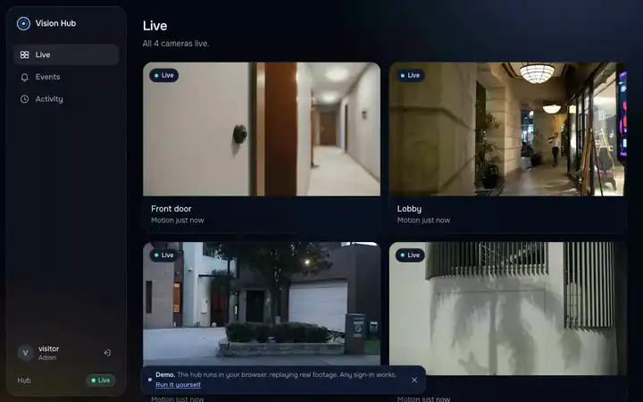
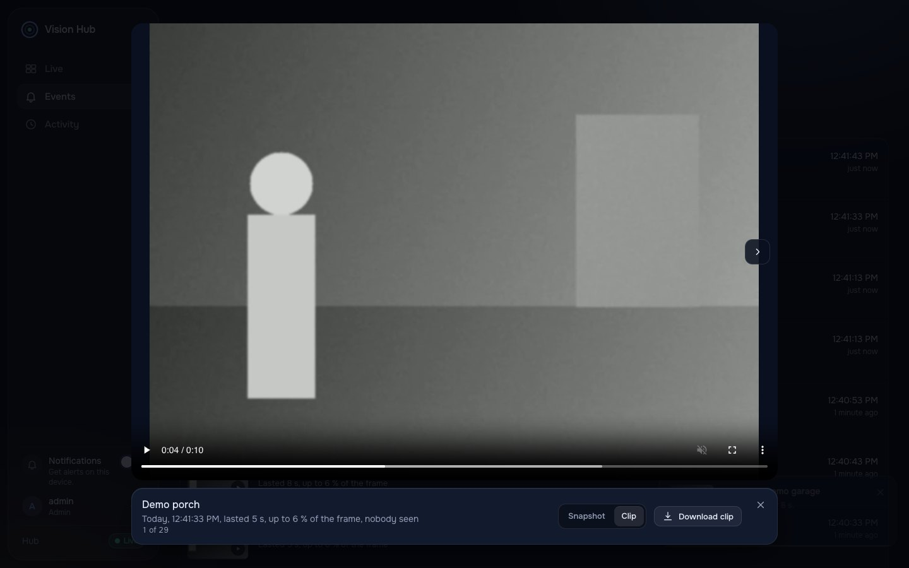
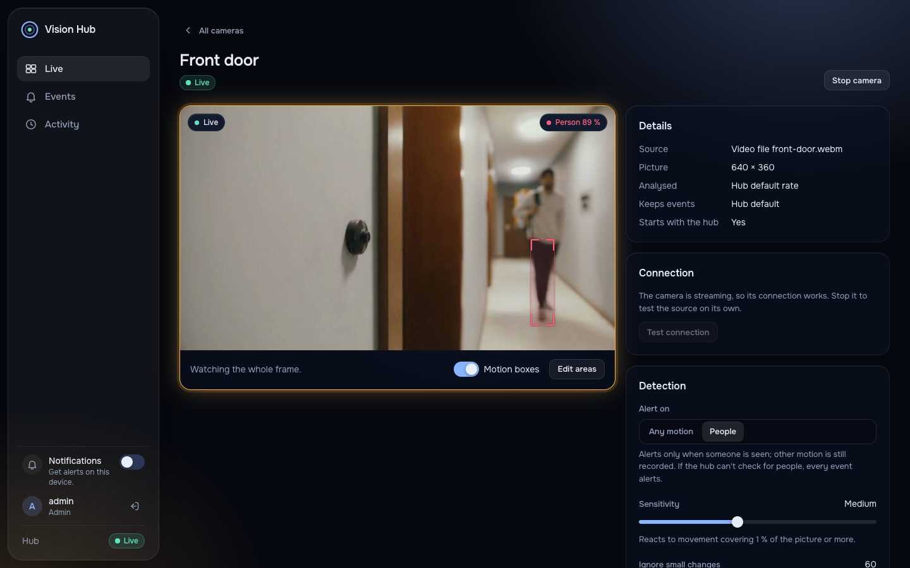
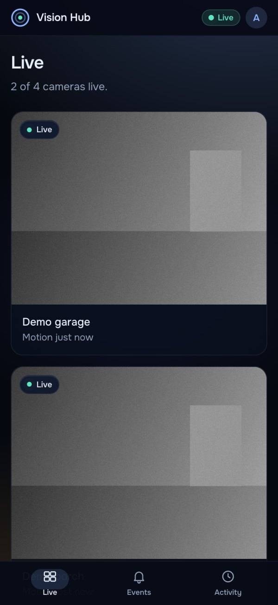
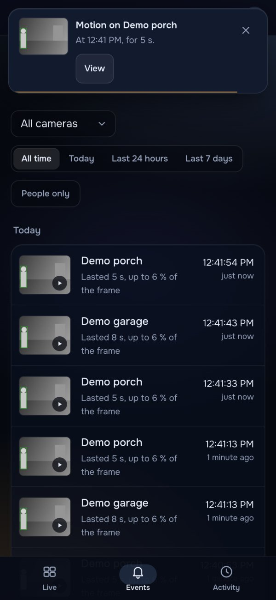
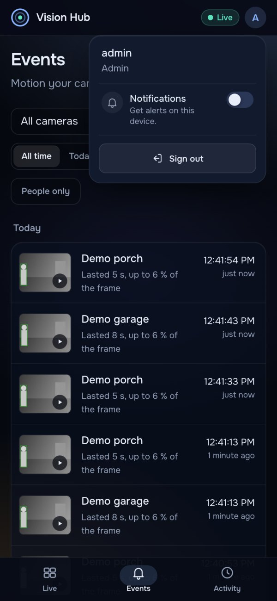
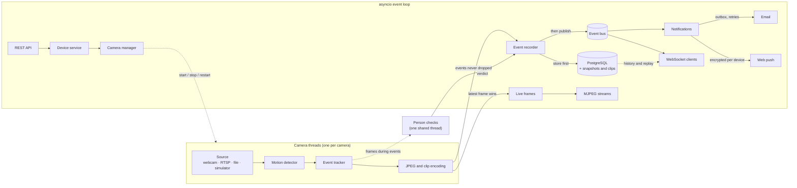

<div align="center">

  <h1>🚨 IoT Vision Hub</h1>

  <p>
    A self-hosted home security hub. It watches your cameras, records every movement with a
    short clip, tells a person from a passing shadow, and alerts your phone within a second.
  </p>

  <p>
    <a href="https://andrewtechtips.github.io/iot-vision-hub/"><strong>▶ Try the live demo</strong></a>: the real dashboard, in your browser, nothing to install.
  </p>

  <p>
    <a href="https://github.com/AndrewTechTips/iot-vision-hub/actions/workflows/ci.yml"></a>
    <a href="https://github.com/AndrewTechTips/iot-vision-hub/actions/workflows/demo.yml"></a>
  </p>

  <p>
    
    
    
    
    
    <br />
    
    
    
    
    
  </p>

</div>

<p align="center">
  <a href="https://andrewtechtips.github.io/iot-vision-hub/"></a>
</p>

---

## ▶ Live demo

**[andrewtechtips.github.io/iot-vision-hub/](https://andrewtechtips.github.io/iot-vision-hub/)** runs the real dashboard, unchanged, against a hub
that lives in your browser tab. Four cameras play real footage, people get boxed in red and
alert, the car and the swaying shadow don't, and every page works: events, clips, settings,
stopping a camera.

How it is made, on every push to `main` ([`demo.yml`](.github/workflows/demo.yml)):

1. `vision-hub demo-footage` fetches the four clips from Pexels and turns them into camera loops
   ([docs/demo-footage.md](docs/demo-footage.md)).
2. `vision-hub export-demo` runs each loop through the real camera worker, motion detector and
   person model, and records what the hub saw: the boxes on every analysed frame, each event
   with its snapshots and clip.
3. The dashboard is built with `--mode demo`: a small hub in [`frontend/src/demo/`](frontend/src/demo)
   answers the API, the WebSocket and the MJPEG streams from that recording, typed against the
   OpenAPI schema so it can't drift from the real API. Live frames are drawn from the looping
   video with their recorded detections, exactly as the hub sends them.
4. Playwright checks it on desktop and phone (alerts, history, deep links, accessibility), and
   GitHub Pages serves it: 4 MB in all, with the videos re-encoded to VP9.

---

## 📖 The story

It started as a single OpenCV script, *Thief Detection Notifier*: watch the webcam, and when
something moves, email me a photo. It worked, mostly. One person walking past sent five emails,
every evening the sunset "moved", and I could only see what happened if I was at my laptop.

So I rebuilt it as a proper service. The hub pulls video from any number of cameras, runs the
detection in its own threads, keeps a history of every event with a clip, and serves a dashboard
that works as an app on my phone. The old script is still in the git history, and the lessons
from it (debounced events, a background that adapts to the light, alerts that never get lost)
shaped most of the design.

---

## 📸 Screenshots

<p align="center">
  <br />
  <sub>Every event has a clip that starts a few seconds before the motion was detected.</sub>
</p>

<p align="center">
  <br />
  <sub>A camera page: the dashboard draws what the hub detected on each frame (red once it is a person), and settings apply without a restart.</sub>
</p>

<p align="center">
  
  &nbsp;
  
  &nbsp;
  
  <br />
  <sub>The same dashboard on a phone, installable as an app.</sub>
</p>

<sub>The cameras in the screenshots are the demo cameras: real footage of a front door, a lobby,
a driveway and a patio (free clips from Pexels, see [docs/demo-footage.md](docs/demo-footage.md)).
All four alert on people only, so the car and the swaying shadow are recorded without an alert.
They run anywhere, no hardware needed.</sub>

---

## ✨ Features

### Watching
- **Any camera:** USB webcams, RTSP cameras (reconnecting on their own), video files and a
  built-in simulator, each on its own thread so nothing blocks the API. Four demo cameras with
  real footage are one command away.
- **Motion detection that holds up outdoors:** a background that adapts to dusk and passing
  clouds, a reset instead of an alarm when the lights switch on, regions to watch drawn on the
  picture, and one event per visit instead of one per flicker.
- **People, not shadows:** each event is checked with a person detector (YOLOX-s, running
  locally). A camera can alert on any motion or on people only.

### Alerts
- **On your phone:** web push notifications with the snapshot, also when the dashboard is
  closed. Encrypted for each device, so the push services only see ciphertext.
- **By email:** the annotated snapshot inline and as an attachment.
- **Never silently lost:** alerts are stored before they are sent and retried with growing
  delays, even across restarts. A cooldown per camera keeps a busy one from flooding you.

### History
- **Every event kept** with its clean frame, annotated frame, thumbnail and a short WebM clip
  that starts before the detection. Download any of them as evidence.
- **Filter** by camera, time and "people only". Old events are deleted on a per-camera schedule.
- **Audit log** of who changed which camera or account, and when.

### Dashboard
- **Live view** of every camera, an event list that updates as things happen, a clip viewer,
  camera settings and the audit log. Works on a phone and a desktop, fully from the keyboard,
  and passes an automated WCAG 2.2 AA audit on every page.
- **Installable app** that opens instantly and still starts (and says so) when the hub is down.
- **Real time without polling:** a WebSocket for events, MJPEG for video, and a replay of
  everything missed while the connection was down.
- **Detections drawn by the dashboard:** each video frame carries what was found on it, so the
  boxes match the picture exactly, turn red once a person is seen, and can be switched off. The
  video itself stays clean.

### Running it
- **One Docker image:** the hub, the dashboard and the person model, as a non-root user on a
  read-only filesystem, with health checks and a graceful shutdown.
- **Secure by default:** short-lived tokens with rotating refresh tokens, roles, rate-limited
  login, signed links for media, encrypted camera passwords, a strict content security policy,
  and production settings that refuse to start when something unsafe is left on.
- **Observable:** Prometheus metrics for every camera (frame rate, time per frame, frame age,
  status) and for alerts, HTTP and event-loop lag.

---

## 🏗️ How it works



Everything heavy (capture, decoding, detection, encoding) runs in threads. OpenCV releases the
GIL, so cameras really run in parallel, and the event loop only ever moves bytes. A test runs live
cameras with asyncio's debug mode flagging any callback slower than 50 ms, and finds none.

Person checks take about 0.3 s of a CPU core each, far too long for a camera thread, so they run
on one background thread shared by every camera. That also caps the feature at one core however
many cameras there are. The numbers behind these choices are in
[`docs/performance.md`](docs/performance.md).

| Layer | Built with |
|---|---|
| API | FastAPI, Pydantic v2, async SQLAlchemy 2, Alembic, PostgreSQL |
| Vision | OpenCV 5, NumPy, ONNX Runtime (YOLOX-s), VP8/WebM clips |
| Real time | WebSockets, MJPEG, an in-process event bus |
| Alerts | Web Push (RFC 8291 encryption, VAPID), SMTP |
| Dashboard | Vanilla JavaScript (ES modules), Vite, Tailwind CSS v4, a service worker |
| Quality | pytest, mypy (strict), Ruff, Vitest, Playwright, axe, Lighthouse |
| Delivery | Docker, Docker Compose, GitHub Actions |

```
src/vision_hub/
├── core/       # settings, logging, security, errors, service container
├── api/        # FastAPI routers, dependencies, middleware, the dashboard's static files
├── schemas/    # request, response and WebSocket models
├── domain/     # domain models and ports (Protocols)
├── services/   # auth, devices, events, notifications, push, audit, health
├── vision/     # sources, motion detector, tracker, clips, person detection, camera workers
├── realtime/   # WebSocket connections and MJPEG streaming
└── infra/      # database, file storage, event bus, email and push, rate limiting
frontend/
├── src/        # the dashboard: views, UI components, API client, realtime, session
├── sw/         # service worker (offline start, notifications)
└── e2e/        # Playwright tests against a real hub, on desktop and phone
```

Design decisions and the development log live in [`ROADMAP.md`](ROADMAP.md), and the rules every
endpoint follows in [`docs/api-conventions.md`](docs/api-conventions.md).

---

## 🚀 Getting started

**With Docker** (hub, dashboard and PostgreSQL):

```bash
git clone https://github.com/AndrewTechTips/iot-vision-hub.git
cd iot-vision-hub
docker compose up --build --wait
docker compose exec api vision-hub create-user admin --role admin
```

Open **http://localhost:8000** and sign in. To try it without cameras, start the **demo
cameras** instead (four scenes of real footage, two with people):

```bash
docker compose -f docker-compose.yml -f docker-compose.demo.yml up --build --wait
```

The first start fetches the clips from Pexels (about 12 MB, checked by SHA-256) and turns them
into camera loops; [docs/demo-footage.md](docs/demo-footage.md) explains how they were chosen.
For your own cameras, mount a `devices.toml` like [`devices.example.toml`](devices.example.toml)
(see the comment in `docker-compose.yml`).

**For development** you need [uv](https://docs.astral.sh/uv/) (it installs Python 3.14 if needed),
Node.js 22.12+ for the dashboard, and a PostgreSQL database:

```bash
docker run -d --name vision-hub-db -p 127.0.0.1:5432:5432 \
  -e POSTGRES_USER=vision_hub -e POSTGRES_PASSWORD=vision_hub -e POSTGRES_DB=vision_hub \
  postgres:17-alpine
uv sync
uv run vision-hub create-user admin --role admin    # migrates the database, asks for a password
uv run vision-hub download-model                    # the person detector (36 MB, optional)
uv run vision-hub demo-footage                      # the demo cameras' footage (12 MB)
(cd frontend && npm ci && npm run build)
VISION_HUB_VISION__DEVICES_FILE=devices.demo.toml \
  VISION_HUB_APP__DASHBOARD_DIR=frontend/dist uv run vision-hub serve
```

The dashboard is then at **http://localhost:8000**, and the interactive API docs at
**http://localhost:8000/docs**. To work on the dashboard with hot reload, run `npm run dev` in
`frontend/` and open **http://localhost:5173**: it proxies the API and WebSockets to the hub.
After changing the API, `npm run api:sync` refreshes the generated types.

### On your phone
Browsers only allow notifications and installing on secure pages, so reach the hub over HTTPS (a
reverse proxy, or a tunnel such as Tailscale) or `localhost`. Then open the dashboard, choose
**Install app** (or *Add to Home Screen* on an iPhone), and turn on **Notifications** (in the
sidebar, or the account menu on a phone). On iPhones and iPads, notifications work once the app
is on the Home Screen.

---

## 🔌 API

| Endpoint | Purpose | Access |
|----------|---------|--------|
| `POST /api/v1/auth/token` · `/refresh` · `/logout` | OAuth2 login, refresh-token rotation, logout | public (rate-limited) |
| `GET /api/v1/auth/me` · `POST /api/v1/auth/tickets` | Current user · single-use ticket for browsers | logged in |
| `GET /api/v1/devices` · `/devices/{id}` | Cameras with live status and last event | logged in |
| `POST` · `PATCH` · `DELETE /api/v1/devices[/{id}]` | Add, update, remove cameras | admin |
| `POST /api/v1/devices/{id}/start` · `/stop` | Run or stop a camera | admin |
| `PUT /api/v1/devices/{id}/detection-config` | Hot-reload detection settings | admin |
| `POST /api/v1/devices/test` | Check a source works before saving it | admin |
| `GET /api/v1/devices/{id}/snapshot` | Latest frame as JPEG | logged in |
| `GET /api/v1/devices/{id}/stream` | MJPEG live stream | logged in (bearer or ticket) |
| `GET /api/v1/events` · `/events/{id}` | Event history (filter by camera, time and `person`) | logged in |
| `GET /api/v1/events/{id}/snapshot?kind=` | Event image: `annotated`, `clean` or `thumbnail` | bearer or signed link |
| `GET /api/v1/events/{id}/clip` | Event video (WebM), with byte ranges for seeking | bearer or signed link |
| `GET /api/v1/audit` | Who changed which device or user, and when | admin |
| `GET /api/v1/push` · `POST /push/subscriptions` · `DELETE /push/subscriptions/{id}` · `POST /push/test` | Web push key, subscribe or unsubscribe a browser, send yourself a test | logged in |
| `WS /api/v1/ws/events` | Live motion and status events | ticket |
| `GET /api/v1/health/live` · `/ready` | Probes for Docker and Kubernetes | public |

Errors are always [RFC 9457](https://www.rfc-editor.org/rfc/rfc9457) `application/problem+json`
with a `request_id` that matches the server logs.

### Real time from a browser

Browsers cannot send an `Authorization` header when opening a WebSocket or an ``, so they
exchange their token for a short-lived, single-use ticket first:

```js
const ticket = async () =>
  (await (await fetch("/api/v1/auth/tickets", { method: "POST", headers: auth })).json()).ticket;

// Live video: a plain  tag
document.querySelector("#porch").src = `/api/v1/devices/porch/stream?ticket=${await ticket()}`;

// Live alerts
const ws = new WebSocket(`wss://${location.host}/api/v1/ws/events?ticket=${await ticket()}`);
ws.onmessage = ({ data }) => {
  const message = JSON.parse(data);  // {type, v, ts, device_id, data}
  if (message.type === "ping") ws.send(JSON.stringify({ type: "pong" }));
  if (message.type === "motion.started") console.log(`Motion on ${message.device_id}`);
};
ws.onopen = () => ws.send(JSON.stringify({ type: "subscribe", devices: ["porch", "gate"] }));
// After a reconnect: {type: "resume", after: lastEventId} replays what was missed
```

Event responses include ready-to-use image and clip URLs (`snapshots[].url`, `clip.url`), signed
and valid for an hour, so `` and `<video src="...">` work without a token.

---

---

## ⚙️ Configuration

All settings are environment variables prefixed with `VISION_HUB_`, with `__` separating nested
groups (for example `VISION_HUB_SMTP__PASSWORD`). Every option is documented in
[`.env.example`](.env.example). With `VISION_HUB_APP__ENV=prod`, the hub refuses to start
without an explicit JWT secret, admin password hash and database password, and rejects debug
mode, wildcard CORS/hosts and unencrypted SMTP.

- **Cameras** live in the database and are managed through the API. A TOML file
  ([`devices.example.toml`](devices.example.toml)) can seed devices the database does not have yet.
  A real `devices.toml` may contain camera passwords, so it is git-ignored and should be mounted
  into containers, not baked into images.
- **Users** are managed with `vision-hub create-user NAME --role admin|viewer`, which also resets
  passwords. `VISION_HUB_SECURITY__ADMIN_PASSWORD_HASH` creates the admin on first start instead.
- **Encryption at rest:** set `VISION_HUB_SECURITY__ENCRYPTION_KEYS` in production; outside
  production a key file is generated once in `data/`. Back it up, or stored camera passwords
  cannot be decrypted.
- **Migrations** run on startup. For schema work: `uv run alembic revision --autogenerate -m "..."`.
- **Event history** is kept for `VISION_HUB_STORAGE__RETENTION_DAYS` (30) days; a camera can
  override it with `retention_days`. Images live under `VISION_HUB_STORAGE__SNAPSHOTS_DIR`.
- **Email alerts** need `VISION_HUB_SMTP__ENABLED=true` plus a server; Gmail with an App
  Password works. Failed deliveries are retried with growing delays
  (`VISION_HUB_NOTIFICATIONS__*`) and survive restarts; an alert may arrive twice after a crash,
  but is never silently lost.
- **Person detection** needs its model: `vision-hub download-model` fetches it (36 MB, checked
  by SHA-256); the Docker image already contains it. Each camera chooses in its detection
  settings whether alerts go out on any motion (the default) or on people only. Without the
  model every event alerts. Checks run on one background thread for all cameras, about 0.3 s
  of one core each, a few per event ([measurements](docs/performance.md#person-detection)).
- **Event clips** are on by default (`VISION_HUB_CLIPS__*`): 3 s before the detection plus the
  event, up to 120 s, at 640 px. Recording costs 6–17 % of a core per camera while an event is
  open, nothing between events; `VISION_HUB_CLIPS__WIDTH=480` halves that
  ([measurements](docs/performance.md#event-clips)).
- **Push notifications** are on by default: anyone signed in can turn them on per device in the
  dashboard. Browsers allow push only on secure pages, so open the dashboard over HTTPS (a
  reverse proxy or a tunnel such as Tailscale) or on `localhost`; a plain `http://192.168…`
  address shows no switch. iPhones and iPads need the dashboard added to the Home Screen first.
  The hub signs with a VAPID key: `vision-hub vapid-key` prints one for
  `VISION_HUB_PUSH__VAPID_PRIVATE_KEY`, otherwise one is created in `data/`. Set
  `VISION_HUB_PUSH__SUBJECT` to a `mailto:` contact (Safari's push service requires one). The
  hub only sends to the browsers' own push services (`VISION_HUB_PUSH__ALLOWED_HOSTS`).
- **Shutdown:** `SIGTERM`/`Ctrl-C` drains gracefully. Requests still open after
  `VISION_HUB_APP__SHUTDOWN_TIMEOUT_SECONDS` (10) are cancelled; give containers more than that
  (compose uses `stop_grace_period: 30s`).
- **Sensitivity** is set per camera: `min_motion_area` (fraction of the frame),
  `pixel_threshold`, regions of interest, and how long a quiet period ends an event.

### Metrics

`GET /metrics` serves Prometheus metrics. Set `VISION_HUB_METRICS__TOKEN` (32+ characters) and
give Prometheus the same token:

```yaml
scrape_configs:
  - job_name: vision-hub
    static_configs:
      - targets: ["vision-hub:8000"]
    authorization:
      credentials: "<VISION_HUB_METRICS__TOKEN>"
```

Useful queries: `rate(vision_hub_camera_frames_analysed_total[1m])` (analysed fps per camera),
`vision_hub_camera_status{status="online"} == 0` (camera down),
`vision_hub_camera_last_frame_age_seconds > 10` (stalled), `vision_hub_alerts_pending > 0` and
`histogram_quantile(0.99, rate(vision_hub_event_loop_lag_seconds_bucket[5m]))`.
Where the CPU goes and how the hub was tuned is in [`docs/performance.md`](docs/performance.md).

---

---

## 🧪 Testing

```bash
uv run ruff check && uv run ruff format --check   # lint (security rules included) and format
uv run mypy                                       # strict type checking
uv run pytest                                     # 870+ tests, 99 % branch coverage
cd frontend && npm run check                      # ESLint, Prettier, types, 100+ unit tests
npm run build && npm run e2e                      # Playwright on desktop and phone
npm run build:demo && npm run e2e:demo            # the public demo (after export-demo)
```

- **Backend:** unit and integration tests run against SQLite and, with
  `VISION_HUB_TEST_POSTGRES_URL` set, PostgreSQL too. They include real video encoding, the real
  person model on a photo and on a video of someone walking into frame, push encryption checked
  against the RFC's own example, and an SMTP server.
- **Dashboard:** end-to-end tests start a throwaway hub with simulated cameras and go through
  sign-in, live video, alerts (measured: on screen 0.2 to 0.5 s after the hub closes an event),
  clips, notifications, offline start, keyboard-only use and an accessibility audit (axe, WCAG
  2.2 AA) of every page, on a desktop and a phone. The public demo has its own run: signed in
  with no server behind it, a person alert opening its clip, deep links, the same audit.
- **Load:** a smoke test runs 5 cameras, 20 WebSocket clients, 2 video viewers and steady API
  traffic; event-loop lag stays at p99 2 ms. `LOAD_SMOKE_SECONDS=60` makes it a longer soak.
- **Lighthouse (mobile):** performance 95 to 100, accessibility 100, best practices 100.

GitHub Actions runs all of it on every push, plus the Docker image and the Compose stack, and
publishes the demo.

---

## 🔒 Security notes

- Passwords are hashed with Argon2. Access tokens last 15 minutes. Refresh tokens rotate, and
  reusing an old one is caught, even across restarts.
- Browsers can't send headers with video or WebSocket requests, so they use single-use tickets;
  snapshots and clips use signed links that expire after an hour.
- Camera passwords are encrypted at rest and never returned by the API.
- Push subscriptions may only point at the browsers' own push services, so the hub can't be
  aimed at internal addresses. Redirects are not followed.
- The dashboard runs under a strict content security policy (no inline scripts or styles) and
  the API refuses unknown `Host` headers.
- ONNX Runtime's telemetry is switched off before the library loads.
- Dependencies are checked with `pip-audit` and `npm audit` (no known vulnerabilities at the
  time of writing).

---

## 📬 Contact

* **LinkedIn:** [Andrei Condrea](https://www.linkedin.com/in/andrei-condrea-b32148346)
* **Email:** condrea.andrey777@gmail.com

Designed and built by me, from the camera threads to the dashboard.

<p align="center">
  <i>"It won't stop them, but they'll know you know." 🎯</i>
</p>
