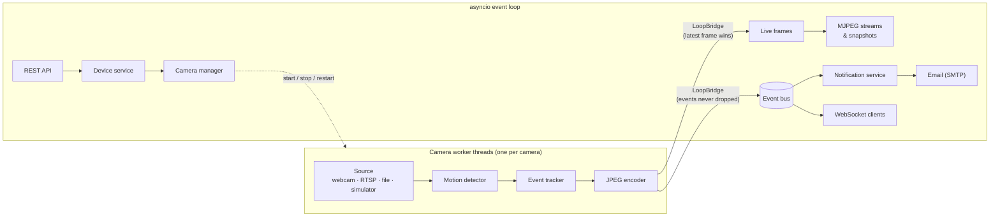

<div align="center">

  <h1>🚨 IoT Vision Hub</h1>

  <p>
    An asynchronous <strong>camera monitoring hub</strong> built with FastAPI and OpenCV.<br />
    It pulls video from your cameras, detects motion in real time, emails you the evidence,
    and pushes alerts and live video to any browser.
  </p>

  <p>
    <a href="https://github.com/AndrewTechTips/Thief-Detection-Notifier/actions/workflows/ci.yml"></a>
  </p>

  <p>
    
    
    
    
    
    
  </p>

</div>

<br />

> **Status:** the backend, camera engine, alerts and real-time delivery are done (Phases 1–2).
> Next up: PostgreSQL persistence for event history (Phase 3), then a web dashboard (Phase 4).
> Progress is tracked in [`ROADMAP.md`](ROADMAP.md). The project started life as a single
> OpenCV script, *Thief Detection Notifier*.

---

## ✨ Features

- **Multi-camera ingestion:** USB webcams, RTSP cameras (with automatic reconnection), video files and a built-in simulator, each on its own worker thread so the API never blocks
- **Smart motion detection:** an adaptive background that ignores dusk and passing clouds, a reset instead of an alarm when the lights switch on, debounced events, per-camera regions of interest, and best-frame selection
- **Email alerts:** the annotated snapshot sent inline and as an attachment, with per-camera cooldowns and retries
- **Real time:** WebSocket alerts with per-camera subscriptions, and MJPEG live streams that work in a plain `` tag
- **Device API:** add, update, start and stop cameras, hot-reload detection settings, and test a source before saving it
- **Secure by default:** JWT with rotating refresh tokens, roles, rate-limited login, single-use stream tickets, write-only camera passwords, security headers, and strict production config checks

<p align="center">
  <br />
  <sub>An alert snapshot as emailed by the hub (simulated camera): the best frame of the event, with the moving region boxed.</sub>
</p>

---

## 🏗️ How It Works



Everything CPU- or IO-heavy (capture, decoding, detection, encoding) runs in worker threads.
OpenCV releases the GIL, so cameras run in parallel, and the event loop only ever handles bytes.
A test runs live cameras with asyncio's debug mode reporting every callback slower than 50 ms,
and finds none.

```
src/vision_hub/
├── core/       # Configuration, logging, security, errors, service container
├── api/        # FastAPI routers, dependencies, middleware
├── schemas/    # Pydantic request/response and WebSocket models
├── domain/     # Pure domain models and ports (Protocols)
├── services/   # Application logic: auth, devices, health, notifications
├── vision/     # Frame sources, motion detector, tracker, camera workers
├── realtime/   # WebSocket connections and MJPEG streaming
└── infra/      # Adapters: event bus, notifiers, auth stores, rate limiting
```

Design decisions are recorded in [`ROADMAP.md`](ROADMAP.md#-architecture-decisions), and the
rules every endpoint follows (errors, pagination, auth, real time) in
[`docs/api-conventions.md`](docs/api-conventions.md).

---

## 🚀 Quick Start

**Requirements:** [uv](https://docs.astral.sh/uv/). It installs Python 3.14 automatically if needed.

```bash
git clone https://github.com/AndrewTechTips/Thief-Detection-Notifier.git
cd Thief-Detection-Notifier
uv sync
cp .env.example .env
uv run vision-hub hash-password   # paste the hash into .env as VISION_HUB_SECURITY__ADMIN_PASSWORD_HASH='...'
VISION_HUB_VISION__DEVICES_FILE=devices.example.toml uv run vision-hub serve
```

Open **http://localhost:8000/docs**, click **Authorize** and log in as `admin`. Two simulated
cameras are running, and a figure walks past each of them every 20–30 seconds.

Or with Docker (`docker compose up --build`). The image runs as a non-root user on a read-only
filesystem, has a built-in health check, and persists data in the `hub-data` volume.

---

## 🔌 API Overview

| Endpoint | Purpose | Access |
|----------|---------|--------|
| `POST /api/v1/auth/token` · `/refresh` · `/logout` | OAuth2 login, refresh-token rotation, logout | public (rate-limited) |
| `GET /api/v1/auth/me` · `POST /api/v1/auth/tickets` | Current user · single-use ticket for browsers | logged in |
| `GET /api/v1/devices` · `/devices/{id}` | Cameras with live status and last event | logged in |
| `POST` · `PATCH` · `DELETE /api/v1/devices[/{id}]` | Add, update, remove cameras | admin |
| `POST /api/v1/devices/{id}/start` · `/stop` | Run or stop a camera | admin |
| `PUT /api/v1/devices/{id}/detection-config` | Hot-reload detection settings | admin |
| `POST /api/v1/devices/test` | Check a source works before saving it | admin |
| `GET /api/v1/devices/{id}/snapshot` | Latest frame as JPEG | logged in |
| `GET /api/v1/devices/{id}/stream` | MJPEG live stream | logged in (bearer or ticket) |
| `WS /api/v1/ws/events` | Live motion and status events | ticket |
| `GET /api/v1/health/live` · `/ready` | Probes for Docker and Kubernetes | public |

Errors are always [RFC 9457](https://www.rfc-editor.org/rfc/rfc9457) `application/problem+json`
with a `request_id` that matches the server logs.

### Real time from a browser

Browsers cannot send an `Authorization` header when opening a WebSocket or an ``, so they
exchange their token for a short-lived, single-use ticket first:

```js
const ticket = async () =>
  (await (await fetch("/api/v1/auth/tickets", { method: "POST", headers: auth })).json()).ticket;

// Live video: a plain  tag
document.querySelector("#porch").src = `/api/v1/devices/porch/stream?ticket=${await ticket()}`;

// Live alerts
const ws = new WebSocket(`wss://${location.host}/api/v1/ws/events?ticket=${await ticket()}`);
ws.onmessage = ({ data }) => {
  const message = JSON.parse(data);  // {type, v, ts, device_id, data}
  if (message.type === "ping") ws.send(JSON.stringify({ type: "pong" }));
  if (message.type === "motion.started") console.log(`Motion on ${message.device_id}`);
};
ws.onopen = () => ws.send(JSON.stringify({ type: "subscribe", devices: ["porch", "gate"] }));
```

---

## ⚙️ Configuration

All settings are environment variables prefixed with `VISION_HUB_`, with `__` separating nested
groups (for example `VISION_HUB_SMTP__PASSWORD`). Every option is documented in
[`.env.example`](.env.example). With `VISION_HUB_APP__ENV=prod`, the hub refuses to start
without an explicit JWT secret, admin password hash and database password, and rejects debug
mode, wildcard CORS/hosts and unencrypted SMTP.

- **Cameras** are defined in a TOML file ([`devices.example.toml`](devices.example.toml)) and
  can be changed at runtime through the API. A real `devices.toml` may contain camera passwords,
  so it is git-ignored and should be mounted into containers, not baked into images.
- **Email alerts** need `VISION_HUB_SMTP__ENABLED=true` plus a server; Gmail with an App
  Password works.
- **Sensitivity** is set per camera: `min_motion_area` (fraction of the frame),
  `pixel_threshold`, regions of interest, and how long a quiet period ends an event.

---

## 🧪 Quality

```bash
uv run ruff check && uv run ruff format --check   # lint and format
uv run mypy                                       # strict type checking
uv run pytest                                     # 530+ tests, 100 % branch coverage
LOAD_SMOKE_SECONDS=60 uv run pytest tests/load -s # longer load soak
```

The load smoke test runs a real server with 5 cameras, 20 WebSocket clients, 2 MJPEG viewers
and steady API traffic. Over 30 seconds on a laptop, event-loop lag stayed at p99 2 ms, the API
answered at p95 6.5 ms, and every client received every motion event. GitHub Actions runs all
checks plus a Docker build and smoke test on every push.

---

## 📬 Contact

* **LinkedIn:** [Andrei Condrea](https://www.linkedin.com/in/andrei-condrea-b32148346)
* **Email:** condrea.andrey777@gmail.com

<p align="center">
  <i>"It won't stop them — but they'll know you know." 🎯</i>
</p>
